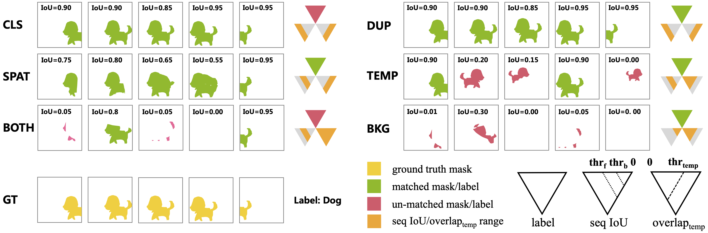

#  TIVE

> [](https://)

 
TIVE is a Toolbox for Identifying Video Instance Segmentation Errors. By isolating error predictions and weighting each type’s demage to mAP, TIVE can distinguish model charactors. TIVE can also report mAP over instance temporal length for real applications.

## Installation

TIVE is available as a python package for python 3.6+, based on [TIDE](https://github.com/dbolya/tide), we reimplemented specific modules for video instance segmentation. To get started with TIVE, simply install TIDE first with pip:

```shell
pip3 install tidecv
git clone https://github.com/wenhe-jia/TIVE.git
```


## Datasets

The currently supported YouTube-VIS json file for YouTubeVIS-2021 `mini_train` and `minival` can be found in [YouTubeVIS-2021-minitrain/minival](https://pan.baidu.com/s/1EFgzjxRTLa4c13izEVkFNQ?pwd=e6kj)(code: e6kj). To evaluate on other common VIS datasets, you need to convert your dataset's format same as YouTube-VIS.


## Usage

TIVE is meant as a drop-in replacement for the [YouTubeVIS Evaluation toolkit]([https://github.com/youtubevos/cocoapi]), get detailed evaluation results on YoutubeVIS-2021-minival subset. For usage, see [example.py](examples/tive_evaluate.py)

Below are example evaluation summary tables for result.json of [SeqFormer](https://github.com/wjf5203/VNext) to the console:
```

-- results_seq_r50 --

mask AP @ [50-95]: 43.37
                                         mask AP @ [50-95]
===================================================================================================
  Thresh       50       55       60       65       70       75       80       85       90       95  
---------------------------------------------------------------------------------------------------
    AP      61.03    59.22    57.56    55.47    52.87    47.91    41.99    33.13    21.56     2.95  
===================================================================================================

                             Main Errors
======================================================================
  Type      Cls     Dupe     Spat     Temp     Both      Bkg     Miss  
----------------------------------------------------------------------
   dAP     6.95     0.25     7.69     4.00     0.00     0.97     6.20  
======================================================================

        Special Error
=============================
  Type   FalsePos   FalseNeg  
-----------------------------
   dAP       5.90      16.49  
=============================

```

And a summary plot for your model's errors:


## License

Shield: [![CC BY-NC 4.0][cc-by-nc-shield]][cc-by-nc]

The majority of TIVE is licensed under a
[Creative Commons Attribution-NonCommercial 4.0 International License](LICENSE).

[![CC BY-NC 4.0][cc-by-nc-image]][cc-by-nc]

[cc-by-nc]: http://creativecommons.org/licenses/by-nc/4.0/
[cc-by-nc-image]: https://licensebuttons.net/l/by-nc/4.0/88x31.png
[cc-by-nc-shield]: https://img.shields.io/badge/License-CC%20BY--NC%204.0-lightgrey.svg

## Citation

If you use TIVE in your research or wish to refer to the baseline results, please use the following BibTeX entry.

```
@article{jia2023tive,
  title={TIVE: A toolbox for identifying video instance segmentation errors},
  author={Jia, Wenhe and Yang, Lu and Jia, Zilong and Zhao, Wenyi and Zhou, Yilin and Song, Qing},
  journal={Neurocomputing},
  volume={545},
  pages={126321},
  year={2023},
  publisher={Elsevier}
}
```

If you find the code useful, please also consider the following TIDE BibTeX entry.

```BibTeX
@inproceedings{bolya2020tide,
  title={Tide: A general toolbox for identifying object detection errors},
  author={Bolya, Daniel and Foley, Sean and Hays, James and Hoffman, Judy},
  booktitle={European Conference on Computer Vision},
  pages={558--573},
  year={2020},
  organization={Springer}
}
```

## Acknowledgement

Code is largely based on TIDE (https://github.com/dbolya/tide).
