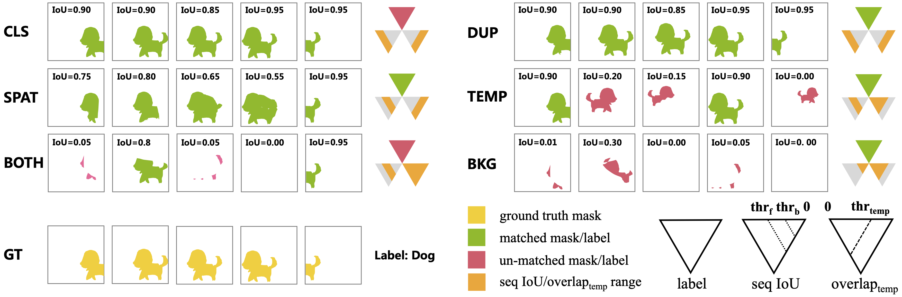
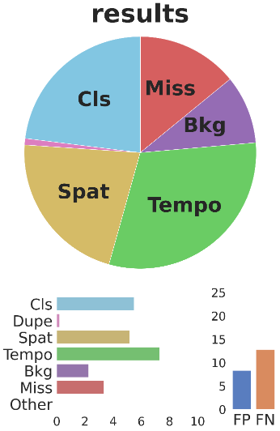

#       A **T**oolbox for **I**dentifying **V**ideo Instance Segmentation **E**rrors

 An toolbox to evaluate the effects of video instance segmentation errors on overall performance. 

> [](https://)

## Installation

TIVE is available as a python package for python 3.6+, based on [TIDE](https://github.com/dbolya/tide), we reimplemented specific modules for video instance segmentation. To get started with TIVE, simply install TIDE first with pip:

```shell
pip3 install tidecv
```


## Datasets

The currently supported YouTube-VIS dataset. json file for YouTubeVIS-2021 `mini_train` and `minival` can be found in [YouTubeVIS-2021-minitrain/minival](https://pan.baidu.com/s/1EFgzjxRTLa4c13izEVkFNQ?pwd=e6kj)(code: e6kj). To evaluate on other common VIS datasets, you need to convert your dataset's format same as YouTube-VIS.


## Usage

TIVE is meant as a drop-in replacement for the [YouTubeVIS Evaluation toolkit]([https://github.com/youtubevos/cocoapi]), get detailed evaluation results on YoutubeVIS-2021-minival subset. For usage, see example.py()

```python
from tivecv import TIVE
import tivecv.datasets as datasets

image_root = 'path/to/youtubevis_2021_train/images'
gt = datasets.YTVIS2021(path='path/to/youtubevis_2021_minival.json')
result = datasets.YTVIS2021Result('path/to/your/results/file')

tive = TIVE(isvideo=True, image_root=image_root)
tive.evaluate_all(gt, result, mode=TIVE.MASK)

tive.summarize()
tive.plot(out_dir='./tive_output')
```

This prints evaluation summary tables for SeqFormer(https://github.com/wjf5203/VNext) to the console:
```

-- results_seq_r50 --

mask AP @ [50-95]: 43.37
                                         mask AP @ [50-95]
===================================================================================================
  Thresh       50       55       60       65       70       75       80       85       90       95  
---------------------------------------------------------------------------------------------------
    AP      61.03    59.22    57.56    55.47    52.87    47.91    41.99    33.13    21.56     2.95  
===================================================================================================

                             Main Errors
======================================================================
  Type      Cls     Dupe     Spat     Temp     Both      Bkg     Miss  
----------------------------------------------------------------------
   dAP     6.95     0.25     7.69     4.00     0.00     0.97     6.20  
======================================================================

        Special Error
=============================
  Type   FalsePos   FalseNeg  
-----------------------------
   dAP       5.90      16.49  
=============================

```

And a summary plot for your model's errors:



## License

Shield: [![CC BY-NC 4.0][cc-by-nc-shield]][cc-by-nc]

The majority of M2FP is licensed under a
[Creative Commons Attribution-NonCommercial 4.0 International License](LICENSE).

[![CC BY-NC 4.0][cc-by-nc-image]][cc-by-nc]

[cc-by-nc]: http://creativecommons.org/licenses/by-nc/4.0/
[cc-by-nc-image]: https://licensebuttons.net/l/by-nc/4.0/88x31.png
[cc-by-nc-shield]: https://img.shields.io/badge/License-CC%20BY--NC%204.0-lightgrey.svg

## Citation

If you use TIVE in your research or wish to refer to the baseline results, please use the following BibTeX entry.

```
@article{jia2022tive,
  title={A Toolbox for Identifying Video Instance Segmentation Errors},
  author={Wenhe Jia, Lu Yang, Zilong Jia, Wenyi Zhao, Yilin Zhou, Qing Song},
  journal={arXiv},
  year={2022}
}
```

If you find the code useful, please also consider the following MaskFormer and Mask2Former BibTeX entry.

```BibTeX
@inproceedings{bolya2020tide,
  title={Tide: A general toolbox for identifying object detection errors},
  author={Bolya, Daniel and Foley, Sean and Hays, James and Hoffman, Judy},
  booktitle={European Conference on Computer Vision},
  pages={558--573},
  year={2020},
  organization={Springer}
}
```

## Acknowledgement

Code is largely based on TIDE (https://github.com/dbolya/tide).
